# Family Manager

Family Manager is an application designed to help families stay organized and manage their tasks effectively. It provides individual and family-wide to-do lists, ensuring no task is forgotten in the hustle of daily life.

## General Overview

This application aims to address the challenges families face in keeping track of tasks and errands. Every family member can maintain their personal to-do list while also accessing shared family tasks.

### Key Features

- **Family Objects:** Contains a list of members and family-wide to-do items.
- **Member Objects:** Each member has a personal to-do list and can belong to a family.
- **Todo Items:** Organized by urgency, description, and completion status.

## Tech Stack

The project utilizes the following technologies:
- **Backend:** Flask, SQLAlchemy, PyJWT, Python-dotenv, PostgreSQL
- **Frontend:** Next.js, TypeScript

## Getting Started

### Backend Setup

1. Install `virtualenv`:
   ```bash
   pip install virtualenv
   ```

2. Create and activate a virtual environment:
   ```bash
   python -m venv venv-name
   # Windows
   path\to\venv-name\Scripts\activate.bat
   # Linux
   source path/to/venv-name/bin/activate
   ```

3. Install dependencies:
   ```bash
   pip install -r requirements.txt
   ```

4. Start the Flask application:
   ```bash
   flask --app app run
   ```

### Frontend Setup

1. Navigate to the `frontend` directory.

2. Install dependencies:
   ```bash
   npm install
   ```

3. Run the development server:
   ```bash
   npm run dev
   ```

4. Open [http://localhost:3000](http://localhost:3000) in your browser.

## Application Pages

First users wil login into their member account using email & password. <br/>
If not a member there is a link to a page to get you all signed up.

### Sign-up/Login Member
- **Sign-up Member:** `http://localhost:3000/signup`
- **Login Member:** `http://localhost:3000/admin/login`

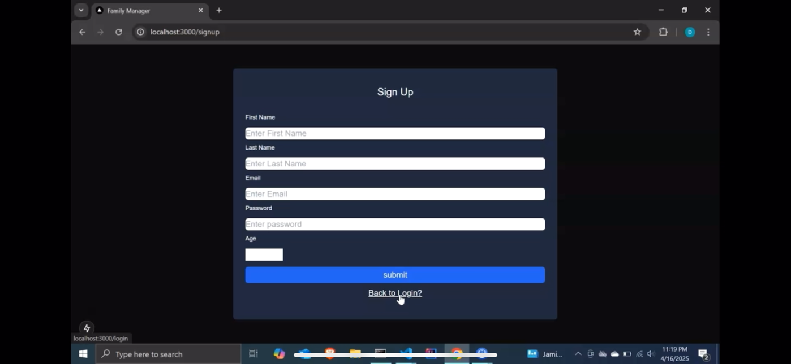 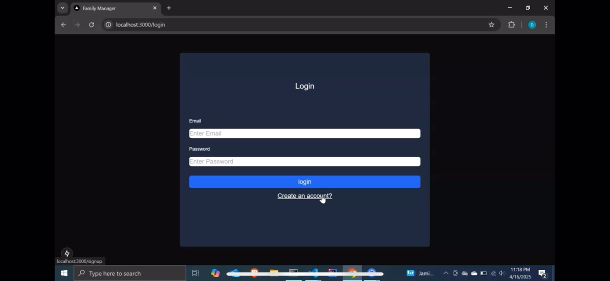

After logging in you will be redirected to the dashboard home page. <br/>

### Home 
- **Home:** `http://localhost:3000/dashboard/home`

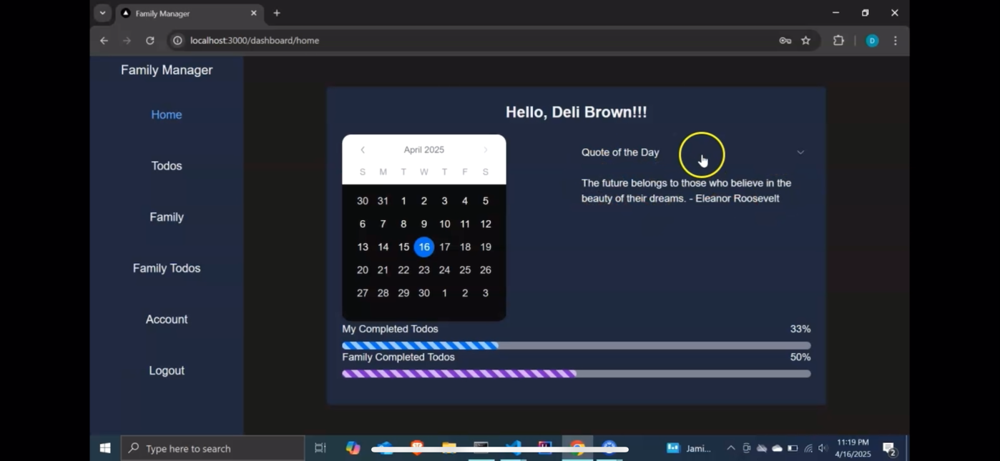

The home page shows a calendar for keeping track of the date.<br/>
A motivational quote that changes daily.
Lastly it contains two process bars for completed percentages for personal & family todos.


From inside the dashboard you have access to <br/>
*your todos, family details, family todos, & your account details* pages.
Click the page name from the nav-bar you want to view.

### Family
- **Family:** `http://localhost:3000/dashboard/family`

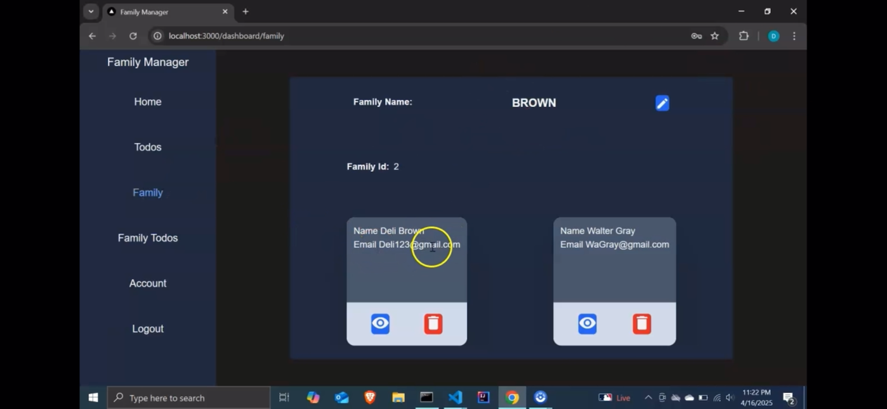 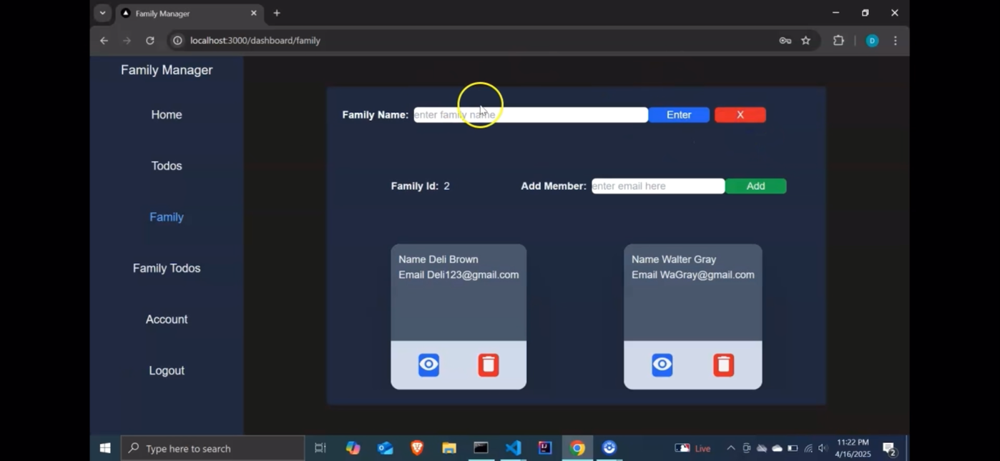

If you're not a member of a family you have the ability to create a family. <br/>
After creating a family you can *view/add/delete* members from family & edit family name.

### Todos
- **View Member Todo Table:** `http://localhost:3000/dashboard/todo`
- **View Family Todo Table:** `http://localhost:3000/dashboard/todo/family`

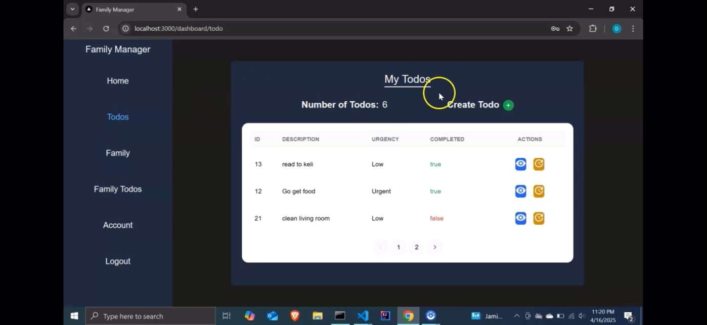 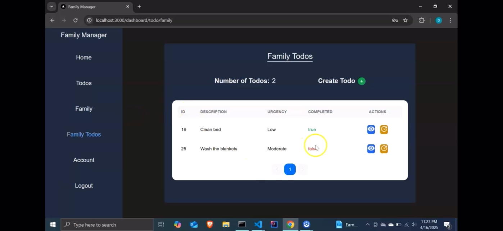

These two pages are identical in terms of appearance & functionality. <br/>
From these pages you have access to *create,view,& update* a todo.

- **Create Todo:** `http://localhost:3000/dashboard/todo/create`

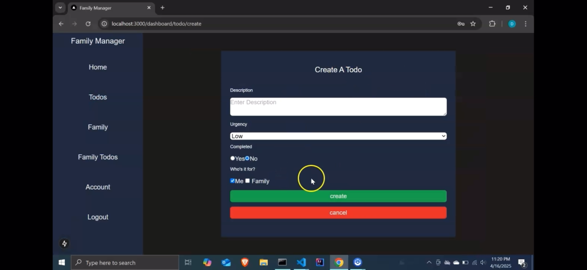

Here you have a form that is used to create a new todo.

- **View Todo by Id:** `http://localhost:3000/dashboard/todo/{id}`

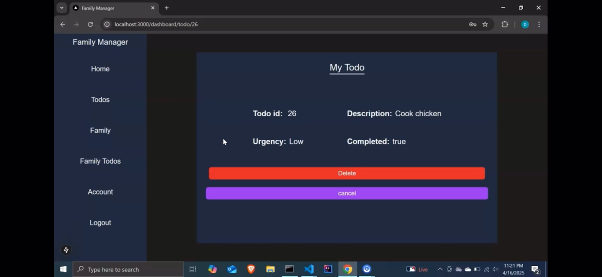

From here you can view all the details about the todo selected to view. <br/>
Also have the option to delete the todo from the table.

- **Update Todo by Id:** `http://localhost:3000/dashboard/todo/update/{id}`

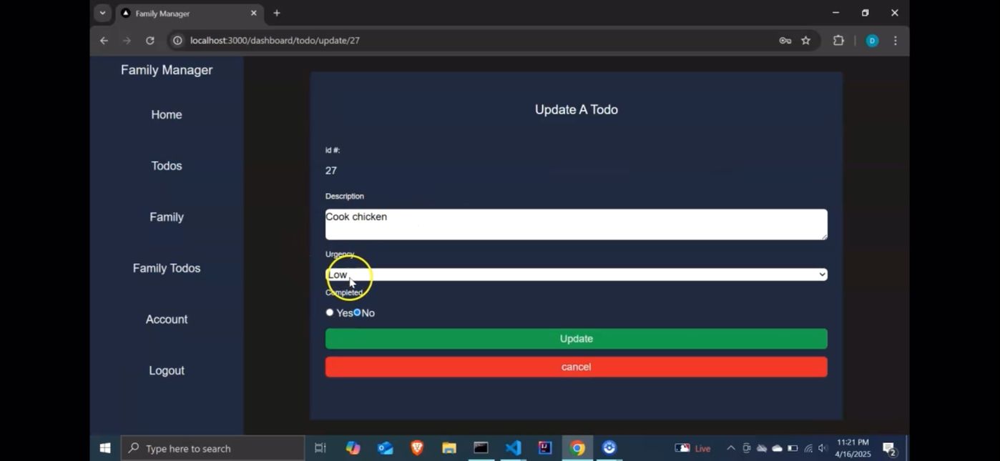

On this page you can edit all the details about the selected todo **except for the Id**.

### Member
- **View Account Details:** `http://localhost:3000/dashboard/member`

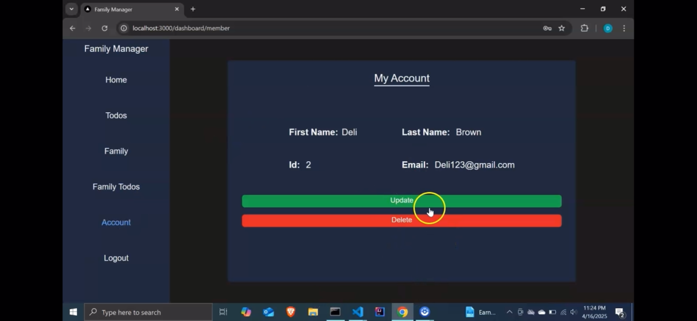 

On this page you can view all your account details, also have the options to delete/edit your account.

- **Edit Account Details:** `http://localhost:3000/dashboard/member/edit/{id}`
  
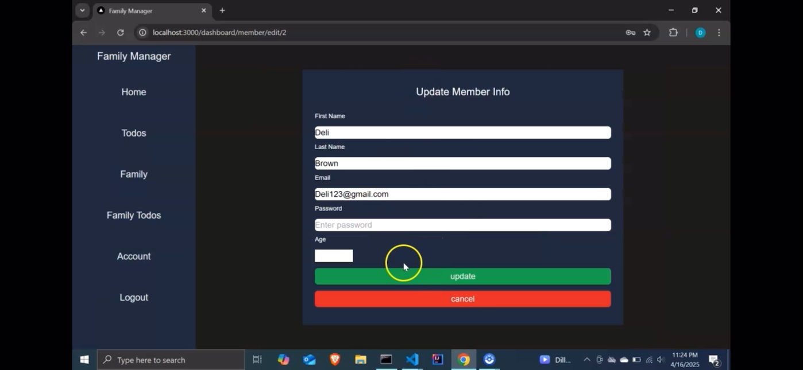

Here is the form to edit account details. 
You have the ability to edit every field but the **id field**.

### Log Out

The Log Out nav link will logout the member and redirect to the login page.

## Project Status

The project is currently in progress with the following planned improvements:
-deploy to a live server 

## Acknowledgements


## Contributions

Contributions are welcome! Please feel free to fork the repository and submit pull requests with improvements or fixes.

## License

[MIT License](LICENSE)
